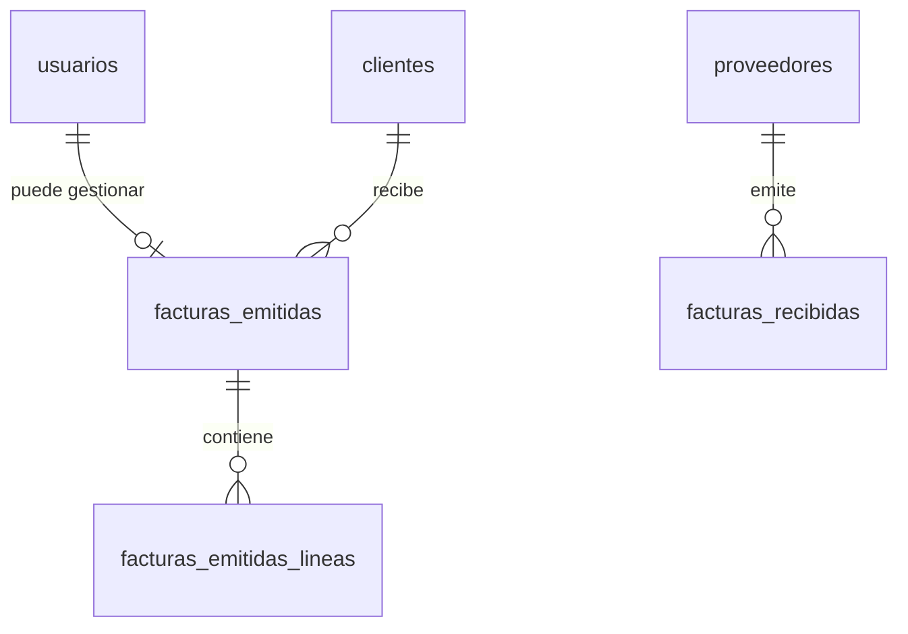

# Documentación de Base de Datos — Libro Contable

Esquema de datos y convenciones aplicadas en la base de datos MySQL/MariaDB.

## Tablas y propósito

### `usuarios`
Gestión de acceso a la aplicación.
- `id`: Autoincremental (PK).
- `username`: Nombre de usuario para login (Unique).
- `password`: Hash BCrypt.
- `nombre`: Nombre legible del usuario.
- `ultimo_acceso`: Timestamp de la última vez que entró.
- `creado_en`: Fecha de registro.

### `clientes`
Directorio de clientes para la emisión de facturas.
- `id`: Autoincremental (PK).
- `nombre`: Razón social o nombre completo.
- `nif`: NIF/CIF fiscal.
- `direccion`, `ciudad`, `cp`, `provincia`: Datos de facturación.
- `activo`: Estado (1: activo, 0: inactivo).

### `proveedores`
Directorio de proveedores para el registro de compras/gastos.
- Estructura idéntica a la tabla `clientes`.

### `facturas_emitidas` (Ventas)
Cabecera de las facturas enviadas a clientes.
- `numero`: Código de factura (Unique, ej: F20260001).
- `cliente_id`: Relación con la tabla clientes.
- `cliente_nombre`, `cliente_nif`: Copia de datos en el momento de emisión (histórico).
- `base_imponible`, `cuota_iva`, `cuota_irpf`, `total`, `liquido`: Importes calculados.
- `estado`: `borrador`, `emitida`, `pagada`, `cancelada`.
- `trimestre`: 1, 2, 3 o 4 (calculado según fecha).

### `facturas_emitidas_lineas`
Detalle de artículos o servicios en facturas emitidas.
- `factura_id`: Relación N:1 con `facturas_emitidas`.
- `cantidad`, `descripcion`, `precio`, `total`: Datos de cada línea.

### `facturas_recibidas` (Compras)
Gastos y compras registrados.
- `numero`: Número de factura del proveedor.
- `proveedor_id`: Relación con la tabla proveedores.
- `base_imponible`, `cuota_iva`, `total`: Desglose de importes.
- `descripcion`: Resumen del gasto.

### `numeracion`
Control de secuencia anual para facturas emitidas.
- `anio`: Año fiscal (PK).
- `ultimo`: Último número correlativo utilizado.

## Relaciones

## Convenciones de BD
- **Charset**: `utf8mb4_unicode_ci` en todas las tablas.
- **Engine**: `InnoDB` para asegurar integridad referencial y transacciones.
- **Importes**: `DECIMAL(12,2)` para dinero, `DECIMAL(10,3)` para cantidades.
- **Fechas**: `DATE` para fechas contables, `TIMESTAMP` para creación/auditoría.
- **Booleanos**: `TINYINT(1)` (0 o 1).

## Migraciones
Los cambios en el esquema deben documentarse aquí y aplicarse mediante scripts idempotentes en `config/migrations/`.
- *(Ejemplo: 2026-03-03_add_tipo_gasto.sql - Añadido campo tipo a facturas_recibidas)*

## Backup
- **Frecuencia**: Se recomienda backup semanal.
- **Método**: Exportación SQL (Estructura + Datos) comprimida en GZIP desde phpMyAdmin.
